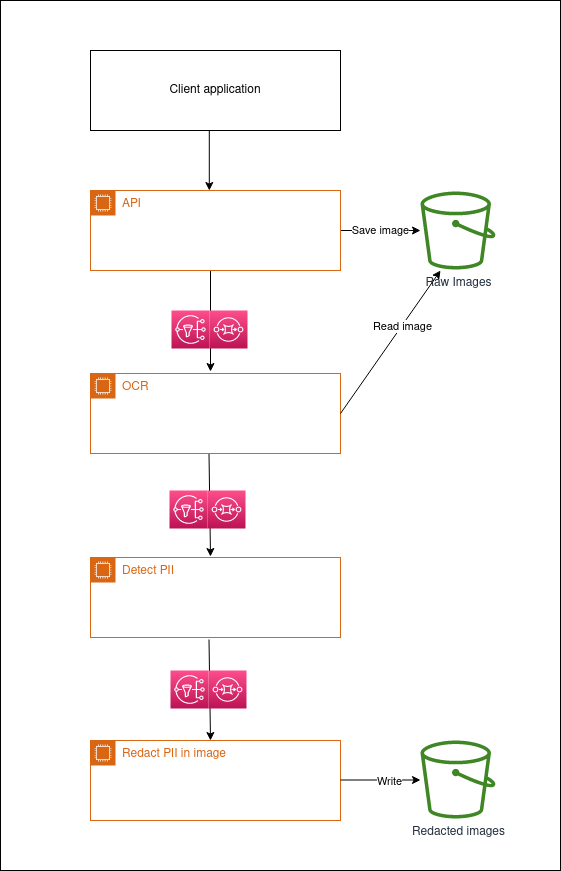

# PHI redaction from images

## Proposed architecture 1: AWS AI services, coordinated by Step Functions

### Advatages:

* Serverless, scales out fast
* Uses AI services, no need to implement smart features
* Basic monitoring and visibility out of the box

### Disadvantages:

* Vendor lock
* Harder to customize functionality and visibility

## Proposed architecture 2: distributed pub-sub micro-services

### Advatages:

* Modular - additional workflows can be added by listening to the same topics
* Flexible
* Ability to set up very detailed monitoring and visibility

### Disadvantages:

* Need work to enable scale out

## POC: single process python script

Code is divided to blocks resembling the architectures above, but activated in-process.

1. cli.py: wrapper to allow cli calls
2. app.py: call the modules and pass data between them
3. imageReaders: class to read an image and output a DataFrame with each word location
 * implementation using Tesseract
4. phiDetectors: class to detect PHI and return words to remove
  * implementation using spaCy
  * alternative implementation using regular expressions
5. imageTransformers: class to remove the PHI from the image
  * implementation drawing red blocks using PIL

### Dependencies

The following libraries are used:

* pytesseract (a wrapper for Google’s Tesseract-OCR Engine)
* pandas
* spaCy 
* spaCy English model for entity recognition (installed using `python -m spacy download en_core_web_md`)

`pip install -r requirements.txt`

### Run

`python cli.py tests/preg-us-no-phi.jpg`
`python cli.py tests/preg-us-with-phi.jpg`
